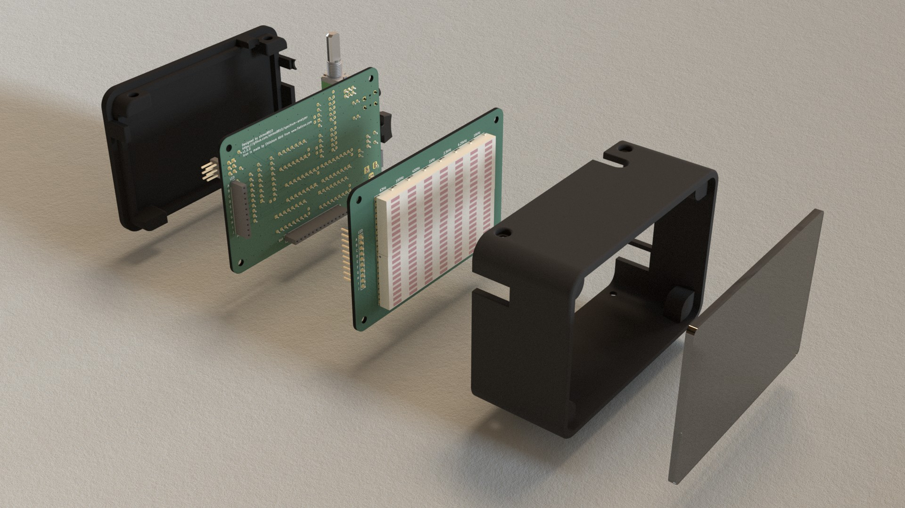
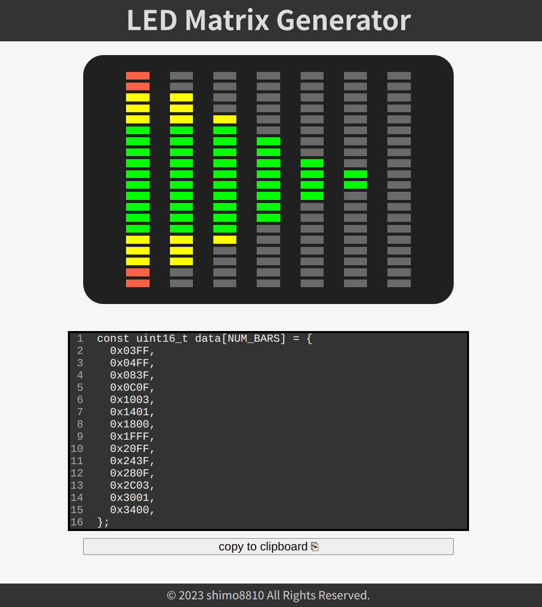

# Spectrum Analyzer

This is a stereo 7-band spectrum analyzer utilizing the MSGEQ7.

## Tools

### LED Matrix Generator

this tool is for generating data for LED matrix.

[LED Matrix Generator Web App](https://shimo8810.github.io/spectrum-analyzer/)

## License

- Software: [MIT License](https://choosealicense.com/licenses/mit/)
- Hardware: [CERN Open Hardware License version 2.0](https://choosealicense.com/licenses/cern-ohl-p-2.0/)

## Acknowledgments

- [Equalizer icons created by Ehtisham Abid - Flaticon](https://www.flaticon.com/free-icons/equalizer)
